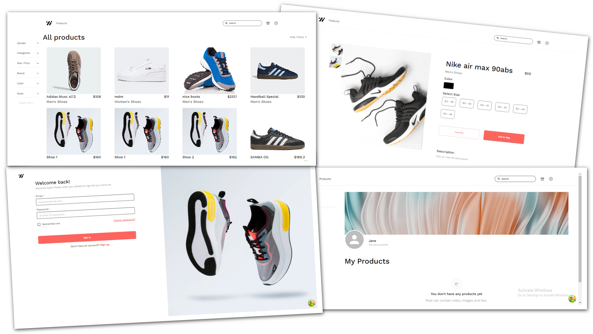

# SHOE SHOP WEB APPLICATION

Welcome to the Shoe Shop Web Application. This project offers a user-friendly platform where customers can browse a wide range of products, manage their own account and add their own offers.

Our platform ensures a seamless user journey, from signing up and logging in to exploring, managing products and adding items to the shopping cart.



## Authors

- [Alejandro Madera](https://github.com/AlexMaderaP)
- [Braian Carabajal](https://github.com/beckman924)
- [Mateusz Aftanski](https://github.com/Afafrr)
- [Mónica Guantay](https://github.com/MoniMcI)
- [Ramón Marino](https://github.com/RamonMarino3005)

## Demo

You will find a live demo of this app here https://shoe-shop-team-4-git-develop-team-4-s-projects.vercel.app/ 

### Environment Variables

The app needs the enviroment variables in a file with the name `.env.local`

```
NEXT_PUBLIC_BASE_URL = 
NEXTAUTH_SECRET = 
NEXTAUTH_URL = 
```

## Technologies used

We have used a modern technology stack to develop this robust, scalable, and high-performance web application. Our choice of tools focused on enhancing user experience, optimizing performance, and simplifying data management and API requests. Each technology was selected to serve a specific role, from building interactive user interfaces to efficiently managing data and ensuring secure authentication. We present the key technologies used and their role in the project’s success:

#### Next.js and Typescript
Ability to create dynamic and scalable web applications with more secure and maintainable code.

#### Material UI
Makes it easy to create modern and stylish user interfaces.

#### React Hook Form / Zod
Efficient form management with robust schema validation using Zod.

#### React Query 
Used to handle state and synchronization of remote data, simplifying API requests and cache management.

#### NextAuth
Authentication and session management with multi-vendor support.

<p>  
  
 
 
 

  

</p>


## Run locally


### Install Dependencies

Run this from the command line:

```
npm install
```
### Run Scripts

```
npm run dev
```

